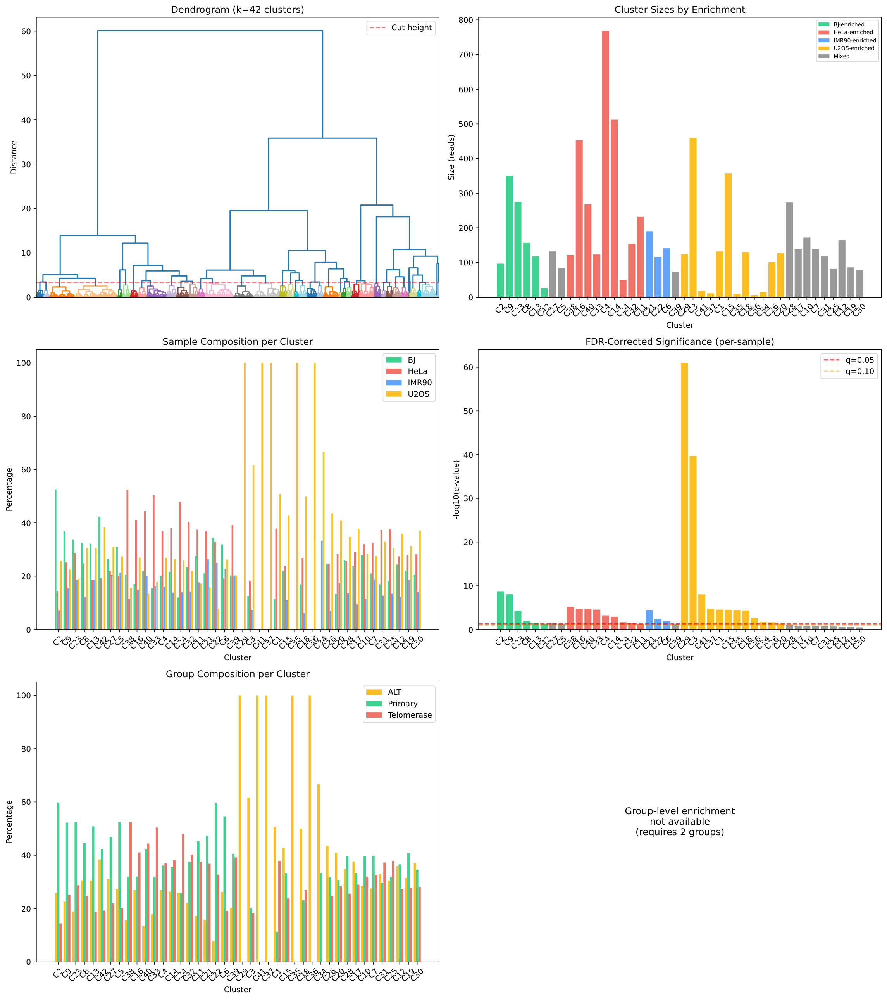
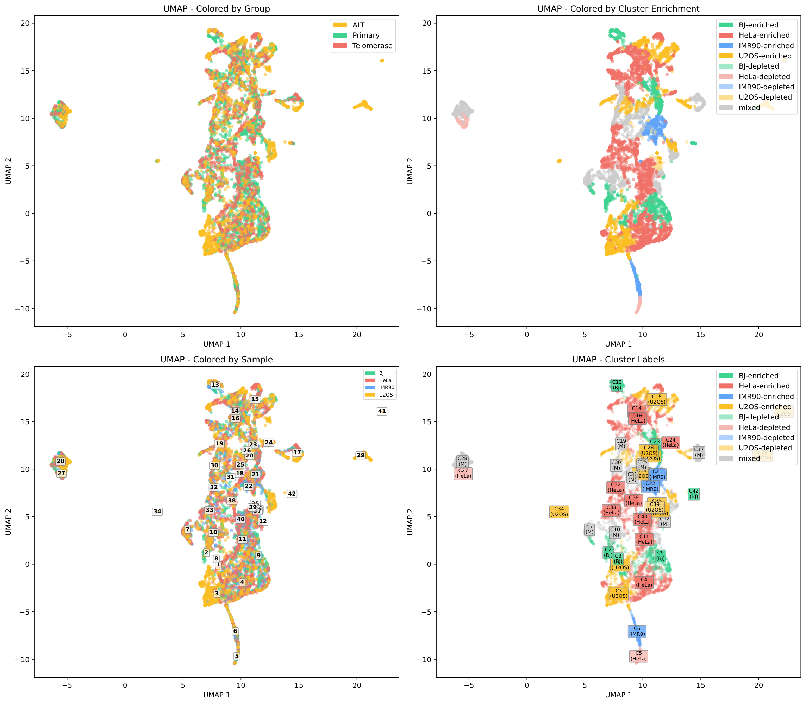
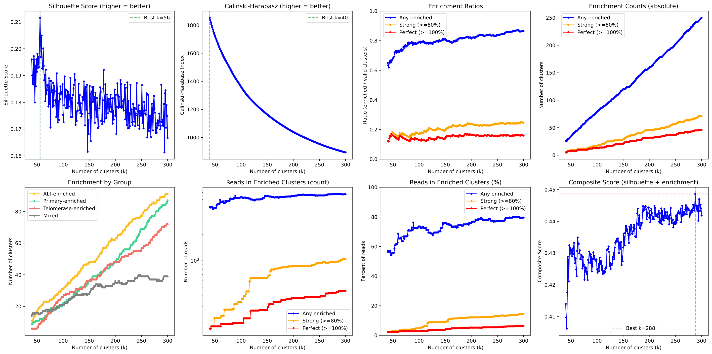
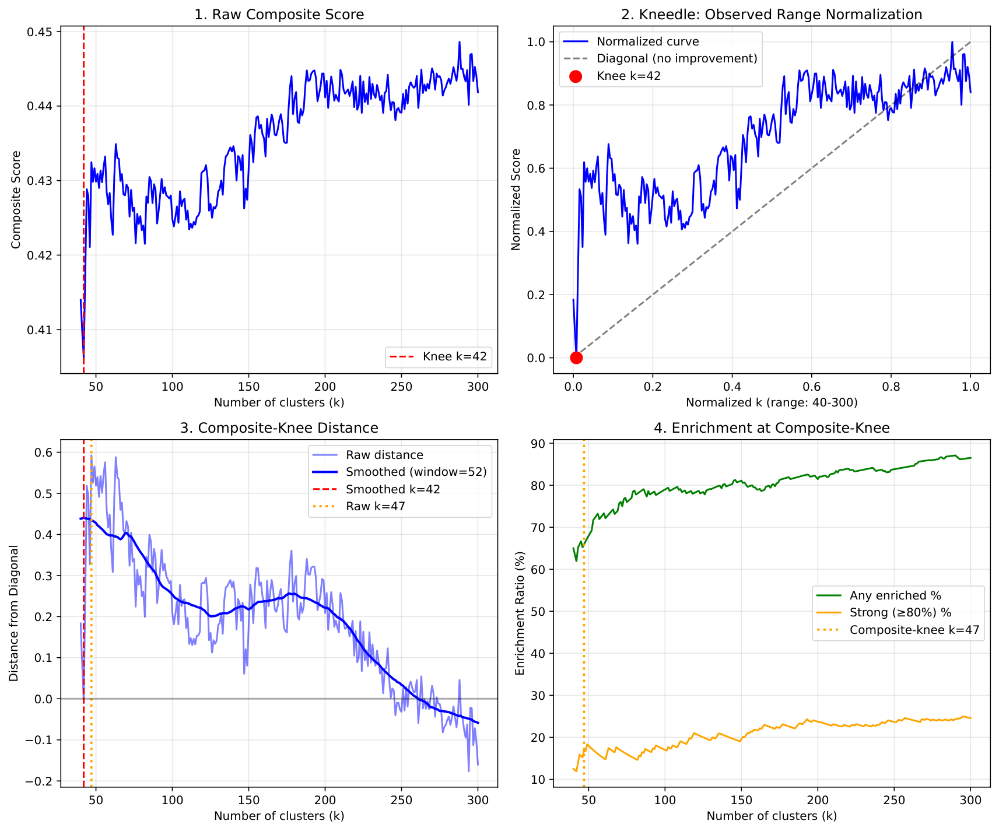
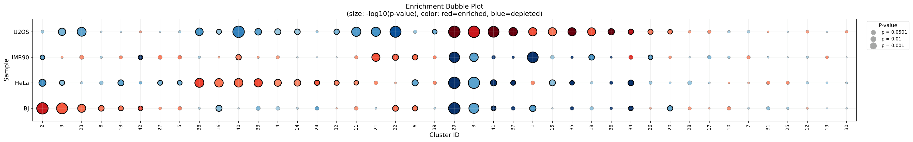
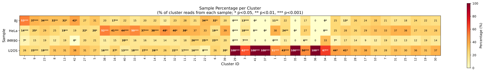
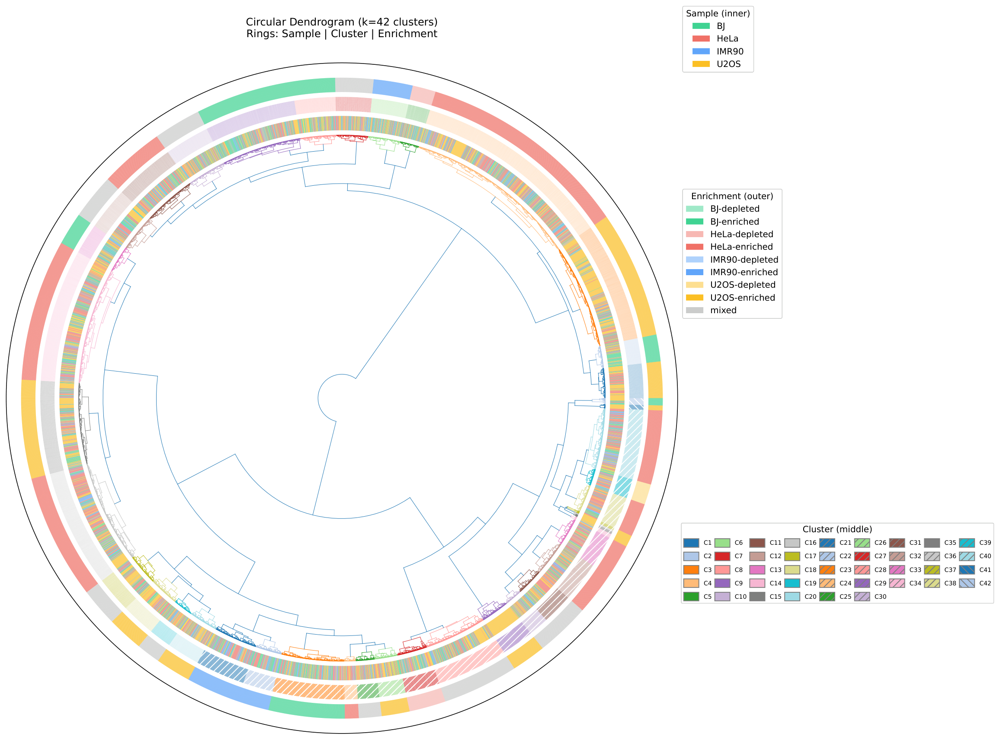

# Quick Start Guide

This guide walks through running KaryoScope clustering analysis on the Core-4 example dataset.

## Prerequisites

- Python 3.11+
- Required packages: numpy, pandas, scipy, scikit-learn, matplotlib, pyranges

## Installation

```bash
# Clone the repository
git clone https://github.com/barthel-lab/KaryoScope-analysis.git
cd KaryoScope-analysis

# Install dependencies
pip install -r requirements.txt
```

## Example Data

The `data/` directory contains feature-annotated telomeric reads from four cell lines:

| Sample | Group | Description |
|--------|-------|-------------|
| BJ | Primary | Primary fibroblast cell line |
| IMR90 | Primary | Primary fibroblast cell line |
| HeLa | Telomerase | Telomerase-positive cancer cell line |
| U2OS | ALT | Alternative Lengthening of Telomeres (ALT) cancer cell line |

**Input files** (`data/raw_bed/`):
- `{sample}.telogator.1.KS_human_CHM13.subtelomeric.smoothed.features.bed.gz` - Subtelomeric features
- `{sample}.telogator.1.KS_human_CHM13.region.smoothed.features.bed.gz` - Region features (satellites, arms)

## Pipeline Overview

The analysis consists of two steps:

1. **Merge Feature Sets**: Combine subtelomeric and region features using priority merge
2. **Run Clustering**: Perform hierarchical clustering and enrichment analysis

---

## Step 1: Merge Feature Sets

Merge subtelomeric and region features for each sample using `--telomere-satellite-merge`:

```bash
for sample in BJ HeLa IMR90 U2OS; do
  python scripts/KaryoScope_merge_beds.py \
    --bed data/raw_bed/${sample}.telogator.1.KS_human_CHM13.subtelomeric.smoothed.features.bed.gz \
         data/raw_bed/${sample}.telogator.1.KS_human_CHM13.region.smoothed.features.bed.gz \
    --output data/merged_bed/${sample}.telomere_region.merged.bed.gz \
    --telomere-satellite-merge
done
```

**What this does:**
- Takes telomeric features (canonical_telomere, noncanonical_telomere, TAR1, ITS) from the subtelomeric file as priority
- Fills remaining positions with features from the region file (satellites, chromosome arms)
- Outputs a single merged BED file per sample

**Expected output:**
```
=== Merging BJ ===
  Subtelomeric intervals: 181,176
  Satellite intervals: 1,212,339
  Common reads: 2,681
  Priority intervals: 106,893
  Merged intervals: 1,301,492
```

---

## Step 2: Create Sample Metadata

Create a sample metadata file (`data/samples.tsv`) that defines sample groups:

```
sample	group	color
BJ	Primary	#40D392
IMR90	Primary	#60A5FA
HeLa	Telomerase	#F07167
U2OS	ALT	#FBBF24
```

---

## Step 3: Run Clustering Analysis

Run the clustering analysis on merged BED files:

```bash
python scripts/KaryoScope_cluster_analysis.py \
  --bed data/merged_bed/BJ.telomere_region.merged.bed.gz \
       data/merged_bed/HeLa.telomere_region.merged.bed.gz \
       data/merged_bed/IMR90.telomere_region.merged.bed.gz \
       data/merged_bed/U2OS.telomere_region.merged.bed.gz \
  --output-prefix results/Core4 \
  --sample-metadata data/samples.tsv \
  --comparison-mode per-sample \
  --k-selection composite-knee \
  --min-sequence-length 10000 \
  --max-sequence-length 50000 \
  --exclude-features "canonical_telomere*,novel,unknown" \
  --umap \
  --circular-dendrogram
```

**Key parameters:**

| Parameter | Value | Description |
|-----------|-------|-------------|
| `--comparison-mode` | `per-sample` | Test each sample independently |
| `--k-selection` | `composite-knee` | Auto-select optimal cluster count |
| `--min-sequence-length` | `10000` | Minimum read length (bp) |
| `--max-sequence-length` | `50000` | Maximum read length (bp) |
| `--exclude-features` | `canonical_telomere*,novel,unknown` | Filter low-information features |

**Expected runtime:** ~5-6 minutes for 8,000 sequences

---

## Output Files

The analysis produces the following outputs in `results/`:

| File | Description |
|------|-------------|
| `Core4.cluster_analysis.tsv` | Cluster statistics, enrichment p-values, sample composition |
| `Core4.sequence_assignments.tsv` | Per-sequence cluster assignments |
| `Core4.cluster_analysis.pdf` | Dendrogram and composition bar charts |
| `Core4.k_selection.pdf` | k-optimization diagnostics |
| `Core4.circular_dendrogram.pdf` | Circular dendrogram visualization |
| `Core4.umap.pdf` | UMAP projection colored by sample/cluster |
| `Core4.enrichment_bubble.pdf` | Enrichment significance bubble plot |
| `Core4.sample_percentage.pdf` | Sample composition heatmap |
| `Core4.log` | Full parameter log and runtime details |

---

## Example Output Figures

### Cluster Analysis Overview

The main cluster analysis figure shows the dendrogram (left) and sample composition per cluster (right):



### UMAP Projection

UMAP visualization shows sample separation in 2D space. Points are colored by sample (left) and cluster (right):



### k-Selection Diagnostics

The k-selection plot shows how different metrics vary with cluster count, helping identify the optimal k:



### Composite-Knee Diagnostic

The composite-knee method finds the point of diminishing returns by measuring distance from the diagonal:



### Enrichment Bubble Plot

Bubble size indicates cluster size, color indicates enrichment direction, and position shows statistical significance:



### Sample Composition Heatmap

Heatmap showing the percentage of each sample within each cluster:



### Circular Dendrogram

Circular dendrogram with sample annotations around the perimeter:



---

## Interpreting Results

### Cluster Summary

The analysis produces ~42 clusters with enrichment categories:

```
Summary
============================================================
Total sequences: 7,182
Number of clusters: 42
  - BJ-enriched: 6
  - HeLa-enriched: 9
  - HeLa-depleted: 2
  - IMR90-enriched: 3
  - U2OS-enriched: 12
  - U2OS-depleted: 1
  - mixed: 9
```

### Reading cluster_analysis.tsv

Key columns:

| Column | Description |
|--------|-------------|
| `Cluster` | Cluster ID |
| `Size` | Number of sequences in cluster |
| `{Sample}%` | Percentage of cluster from each sample |
| `P-value` | Fisher's exact test p-value |
| `Q-value` | FDR-corrected q-value |
| `Enrichment` | Enrichment call (e.g., "U2OS-enriched", "HeLa-depleted", "mixed") |
| `Centroid` | Sample of the centroid sequence (⚠️ = mismatch) |

### Enrichment Categories

- **Sample-enriched** (q < 0.05): Cluster significantly over-represented by one sample
- **Sample-depleted** (q < 0.05): Cluster significantly under-represented by one sample
- **mixed**: No significant enrichment or depletion after FDR correction

### Centroid Warnings

A ⚠️ next to the centroid indicates that the centroid sequence comes from a different sample than the enrichment label. This suggests cluster heterogeneity and may warrant further investigation.

---

## Next Steps

1. **Visualize specific clusters**: Use `KaryoScope_cluster_plot.py` to visualize reads from specific clusters
2. **Explore the figures**: Review the output PDFs for detailed visualization
3. **Check enrichment patterns**: Look for sample-specific structural patterns in the enrichment results
